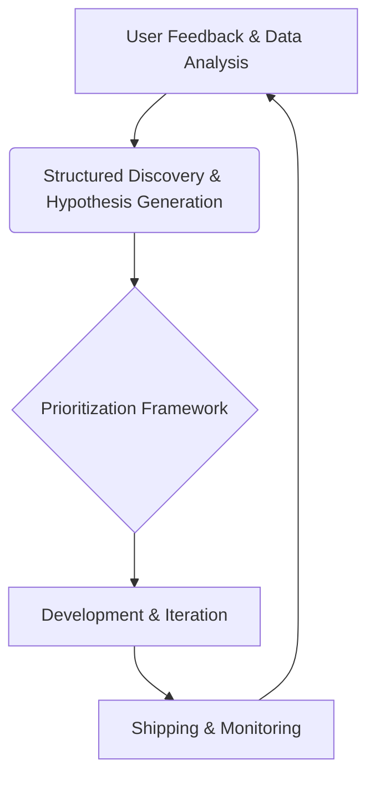

## Thesis — YouTube's product organization prioritizes structured discovery and delivery processes.

## Context — YouTube is a large-scale video-sharing platform enabling users to upload, share, and enjoy content globally.

## Operating loop

## Ownership
* Discovery: Supported by user feedback and data analysis.
* Prioritization: Guided by a specific framework.
* Shipping: Involves development and iteration.
* Sales Input: Not explicitly mentioned.
* Design: Not explicitly mentioned.

## Evidence
*No clean quote extracted — see interview link.*

## Gaps
* Specific methodologies for structured discovery are not detailed.
* The exact nature of the prioritization framework is unclear.
* Details on how design is integrated into the product process are absent.

## Listen

- YouTube: [La Product Fest Desde Dentro - 7 Entrevistas a Speakers, Sponsors y Staff](https://www.youtube.com/watch?v=3RDIOPMh9sk)
- Audio: [episode audio](https://anchor.fm/s/ddca5200/podcast/play/92763329/https%3A%2F%2Fd3ctxlq1ktw2nl.cloudfront.net%2Fstaging%2F2024-9-8%2F387761899-44100-2-7b89c18e87e86.mp3)
- Show: [Entrevistas a Product Leaders](https://podcasters.spotify.com/pod/show/danidiestre)
- Host: [Dani Diestre](https://www.youtube.com/@DaniDiestre)

_Unofficial community note. Episode © host / guests. See [docs/LEGAL.md](../docs/LEGAL.md)._
