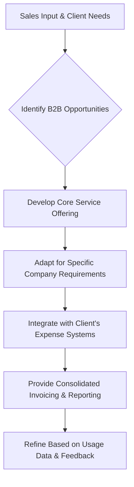

## Thesis
Cabify’s B2B wedge is predictable corporate pricing plus full-trip invoicing on the same driver network — sales-led discovery shapes product more than consumer marketplace A/B loops.

## Context
Cabify operates in the ride-sharing and mobility sector, serving both individual passengers and businesses. The company has a significant presence in Spain and Latin America, competing with global players like Uber.

## Operating loop

## Ownership
*   **Discovery:** Primarily driven by sales teams who are closest to client needs and market opportunities. Product teams collaborate with sales to understand these needs and translate them into service offerings.
*   **Prioritization:** Influenced by sales input regarding revenue potential and ease of sale, alongside product team analysis of market trends and technological feasibility.
*   **Shipping:** Involves adapting the core service for specific client requirements and ensuring seamless integration with their systems.
*   **Sales Input:** Crucial for identifying opportunities and shaping the product roadmap.
*   **Design:** Focuses on creating a user-friendly platform for businesses, including features for expense control and reporting.

## Evidence
*   *Cabify's configuration for businesses generates a full invoice for the entire trip, whereas Uber's configuration invoices only its commission.*
*   *The company aims to provide predictable pricing and comprehensive reporting, which is a significant advantage for businesses managing expenses.*

## Gaps
*   The interview does not detail the specific metrics used to measure the success of B2B product initiatives beyond general revenue and trip numbers.
*   There is limited information on how product teams directly engage with end-users (employees of client companies) versus relying solely on sales feedback.
*   The specific technological challenges and solutions for dynamic pricing and fleet management in diverse regulatory environments are not deeply explored.

## Listen

- YouTube: [Las claves para ser Product Manager con Ramón Andrío, Head of Product de Cabify](https://www.youtube.com/watch?v=CnxPjb9Ha-k)
- Audio: [episode audio](https://anchor.fm/s/ddca5200/podcast/play/73326189/https%3A%2F%2Fd3ctxlq1ktw2nl.cloudfront.net%2Fstaging%2F2023-6-12%2F339023734-44100-2-415a3eb12cea6.mp3)
- Show: [Entrevistas a Product Leaders](https://podcasters.spotify.com/pod/show/danidiestre)
- Host: [Dani Diestre](https://www.youtube.com/@DaniDiestre)

_Unofficial community note. Episode © host / guests. See [docs/LEGAL.md](../docs/LEGAL.md)._
