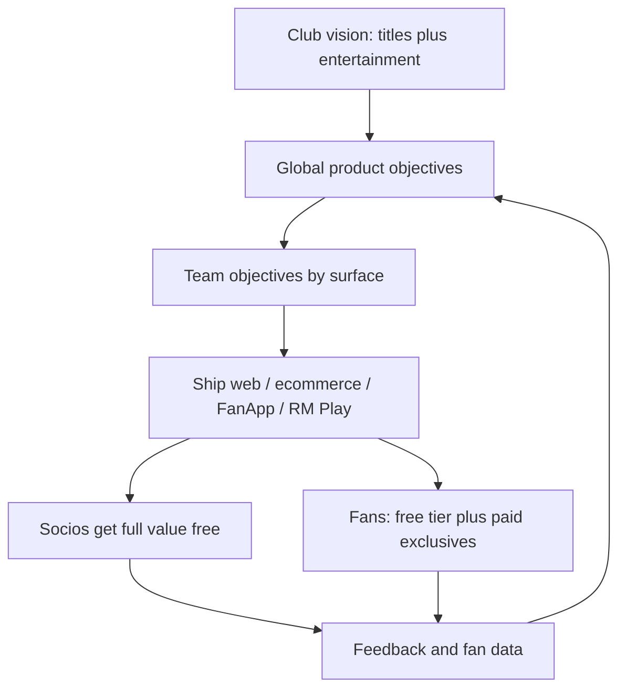

## Thesis
Real Madrid never monetizes socios — digital product gives ~100k member-owners full value free (RM Play included) while the ~600M global fan base is the entertainment market competing with Netflix for attention.

## Context
Carlos Sánchez leads digital product at Real Madrid after a product-design path. The club’s stack spans web, ecommerce, FanApp, madridistas.com, and the newly launched RM Play streaming service — part of shifting from titles-only to an entertainment company.

> Note: the RSS/YouTube title wrongly says “SaferLayer”; the interview is Real Madrid digital product.

## Operating loop

## Ownership
- **Discovery:** Fan and member data plus input from marketing, VIP, socios, and fan-facing teams — qualitative research is hard at 600M scale.
- **Prioritization:** Global objectives cascade to team goals; socios value is non-negotiable even when not monetized.
- **Shipping:** Surfaces launch to all user types at once; digital-native / younger fans tend to adopt first.
- **Sales-input:** Business areas (marketing, VIP, socios, fan teams) feed priorities — not a classic SaaS sales org.
- **Design:** Head of digital product comes from product design and previously led design teams; design is inside the product org.

## Evidence
- *We have about 600 million fans worldwide.*
- *We are competing not only with other clubs but also with people like Netflix for our users' attention.*
- *We never try to monetize our socios… RM Play is 100% free for socios.*

## Gaps
- Exact success metrics per surface (ecommerce vs RM Play vs FanApp) are not spelled out.
- How stadium / offline experience teams join the digital priority stack is only sketched.
- Team topology under the Head of Digital Product is not detailed.

## Listen

- YouTube: ["Se Viralizó y Llevamos 52.000 Documentos Procesados" | Saferlayer de Carlos Sánchez](https://www.youtube.com/watch?v=3BurkAX8YnQ)
- Audio: [episode audio](https://anchor.fm/s/ddca5200/podcast/play/102287498/https%3A%2F%2Fd3ctxlq1ktw2nl.cloudfront.net%2Fstaging%2F2025-4-6%2F399750754-44100-2-972ab49309265.mp3)
- Show: [Entrevistas a Product Leaders](https://podcasters.spotify.com/pod/show/danidiestre)
- Host: [Dani Diestre](https://www.youtube.com/@DaniDiestre)

_Unofficial community note. Episode © host / guests. See [docs/LEGAL.md](../docs/LEGAL.md)._
