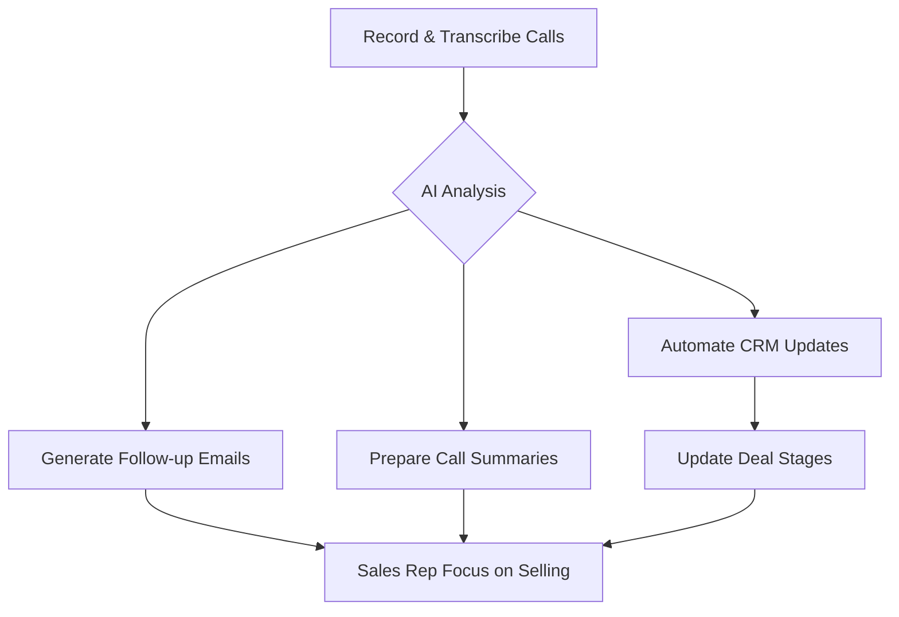

## Thesis
Ting sells sales automation that recovers the hours reps waste outside calling — product value is measurable talk-time and pipeline hygiene, not another CRM dashboard.

## Context
Ting offers a software solution for sales teams, leveraging AI to increase efficiency by automating administrative tasks. The company is in its early stages, founded by Marta Cavestany after identifying a significant inefficiency in sales workflows.

## Operating loop

## Ownership
*   **Discovery:** Supported by founder's direct experience with sales inefficiencies.
*   **Prioritization:** Driven by solving the core pain point of sales reps spending excessive time on non-selling activities.
*   **Shipping:** Focus on AI-driven automation of tasks like CRM updates and follow-up emails.
*   **Sales-input:** Direct input from founder's background in a logistics company with a large sales team.
*   **Design:** Product interface designed to resemble a CRM for ease of adoption.

## Evidence
*   *The core problem identified was that salespeople were only spending an average of two and a half hours a day making calls.*
*   *Ting is a software that helps salespeople sell more by being more efficient in their day-to-day.*

## Gaps
*   The specific metrics used to measure the success of Ting's AI automation are not detailed.
*   The long-term strategy for competing with established CRMs and larger AI analytics platforms like Gong is not fully elaborated.
*   Details on the team structure beyond the founder and CTO are not provided.

## Listen

- YouTube: ["Los comerciales SOLO llaman 2 HORAS al DÍA" | Marta Cavestany, CEO & Founder de Ting](https://www.youtube.com/watch?v=v8QuIhRXGIw)
- Audio: [episode audio](https://anchor.fm/s/ddca5200/podcast/play/89281196/https%3A%2F%2Fd3ctxlq1ktw2nl.cloudfront.net%2Fstaging%2F2024-6-17%2F383339732-44100-2-27ba5eeb35383.mp3)
- Show: [Entrevistas a Product Leaders](https://podcasters.spotify.com/pod/show/danidiestre)
- Host: [Dani Diestre](https://www.youtube.com/@DaniDiestre)

_Unofficial community note. Episode © host / guests. See [docs/LEGAL.md](../docs/LEGAL.md)._
