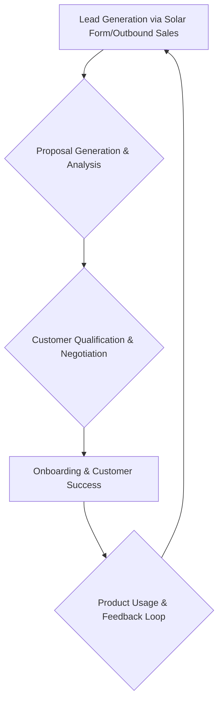

## Thesis
Suntropy abandoned PLG self-serve when conversion collapsed with the market — product acquisition flipped to sales-led because the funnel stopped working alone.

## Context
Suntropy provides B2B software for solar panel installers and sellers, automating the complex process of generating solar installation proposals. The company experienced rapid growth with a self-service model but faced a market contraction that drastically reduced conversion rates.

## Operating loop

## Ownership
*   **Discovery**: Primarily driven by sales input and direct customer feedback post-pivot. Previously, it was heavily influenced by product-led growth metrics and user behavior.
*   **Prioritization**: Now influenced by sales team feedback and strategic business goals, shifting from PLG-driven feature adoption.
*   **Shipping**: Developers, with input from product and sales, manage shipping.
*   **Sales Input**: Directly incorporated through the new sales team and outbound efforts.
*   **Design**: Primarily handled by developers, with a focus on intuitive UX integrated into the codebase rather than a dedicated design team.

## Evidence
*   *We started to see that this wasn't working. Overnight, without changing anything in the product or marketing strategy, we started to see that this wasn't working.*
*   *The market had changed drastically from one year to the next, and that doesn't usually happen in all markets.*

## Gaps
*   The specific metrics used to track the success of the sales-led model are not detailed.
*   The long-term product roadmap and future feature development strategy are not elaborated upon.
*   Details on how the company scales its technology infrastructure to support growth are not provided.

## Listen

- YouTube: ["Nos cayó la conversión de un 10% a un 0.5% por el mercado" | Founder Suntropy](https://www.youtube.com/watch?v=aJRs_gQWXAQ)
- Audio: [episode audio](https://anchor.fm/s/ddca5200/podcast/play/83613779/https%3A%2F%2Fd3ctxlq1ktw2nl.cloudfront.net%2Fstaging%2F2024-2-5%2F369840707-44100-2-4d18f5f94ea07.mp3)
- Show: [Entrevistas a Product Leaders](https://podcasters.spotify.com/pod/show/danidiestre)
- Host: [Dani Diestre](https://www.youtube.com/@DaniDiestre)

_Unofficial community note. Episode © host / guests. See [docs/LEGAL.md](../docs/LEGAL.md)._
