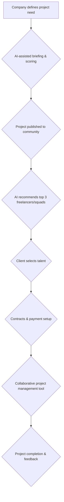

## Thesis
Shakers’ north star is repeat clients, not one-off freelance matches — product pushes collaborative squads so companies come back for the next project.

## Context
Shakers is a marketplace that connects technology freelancers with companies seeking talent. The platform facilitates the creation of project teams, or "squads," composed of diverse freelancers who can collectively take on projects that might be too large for individuals.

## Operating loop

## Ownership
- **Discovery:** Primarily driven by the client's project definition, with AI assistance and human intervention for lower-scoring briefs.
- **Prioritization:** AI-driven matching of freelancers to projects based on skills, project needs, and potentially personality fit.
- **Shipping:** Managed through a collaborative project management tool built by Shakers, with milestones unlocking payments.
- **Sales-input:** Handled by a sales machine that specializes by buyer persona, industry, and company size.
- **Design:** Supported by Shakers' product team and potentially external design consultants.

## Evidence
- *Shakers is born to create squads and be able to opt between unknown but brilliant people for bigger projects.*
- *Our North Star is that the client repeats.*

## Gaps
- The specific criteria and algorithms used for AI-driven matching, beyond general skill sets, are not fully detailed.
- The internal processes for verifying and vetting the quality of freelancers are mentioned but not elaborated upon.
- The long-term strategy for scaling the supply side of the marketplace and managing potential talent shortages is not fully explored.

## Listen

- YouTube: ["Nuestra North Star es que el cliente repita" con Adrián de Pedro, CPTO de Shakers](https://www.youtube.com/watch?v=vcTacjzmYlA)
- Audio: [episode audio](https://anchor.fm/s/ddca5200/podcast/play/80846839/https%3A%2F%2Fd3ctxlq1ktw2nl.cloudfront.net%2Fstaging%2F2024-0-5%2F362297215-44100-2-047cdd9dee58f.mp3)
- Show: [Entrevistas a Product Leaders](https://podcasters.spotify.com/pod/show/danidiestre)
- Host: [Dani Diestre](https://www.youtube.com/@DaniDiestre)

_Unofficial community note. Episode © host / guests. See [docs/LEGAL.md](../docs/LEGAL.md)._
