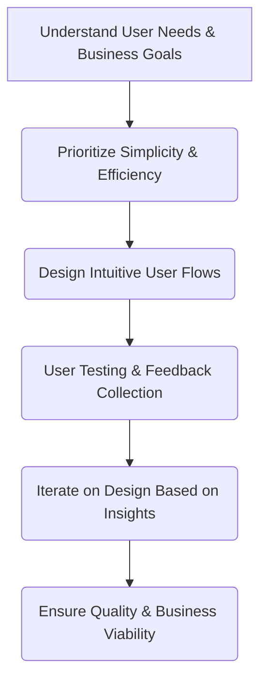

## Thesis
Mercadona Tech design optimizes for speed-to-checkout simplicity — grocery UX wins when shoppers finish fast without cognitive load.

## Context
Mercadona Tech operates as the online arm of the Spanish supermarket chain Mercadona. The company focuses on delivering a seamless online shopping experience, emphasizing quality and valuing the customer's time above all else.

## Operating loop

## Ownership
*   **Discovery:** Primarily owned by Product Designers, who gather qualitative insights from users. Product Managers contribute with quantitative data analysis.
*   **Prioritization:** Shared responsibility, with Product Managers owning quantitative data and Product Designers driving qualitative understanding.
*   **Shipping:** Product Managers are responsible for the overall product strategy and ensuring the team can execute it.
*   **Sales Input:** Not explicitly detailed, but the "customer is king" philosophy implies sales and business needs are central.
*   **Design:** Owned by Product Designers, who are responsible for the user interface and overall user experience.

## Evidence
*   *The customer is king, always having the boss at the center.*
*   *We want to give the user or customer what they want, what they need, and not something that we want them to buy because they buy more things.*

## Gaps
*   Specific details on how A/B testing or other quantitative experimentation is integrated into the design process.
*   The exact structure and cadence of collaboration between Product Managers and Product Designers beyond general principles.
*   Details on how the company handles technical debt or legacy systems within its product development lifecycle.

## Listen

- YouTube: [Product Leaders #3 - El diseño en equipos de Producto con David de la Iglesia, Head of Product Design de Mercadona Tech](https://www.youtube.com/watch?v=0FU447iVRfw)
- Audio: [episode audio](https://anchor.fm/s/ddca5200/podcast/play/69599902/https%3A%2F%2Fd3ctxlq1ktw2nl.cloudfront.net%2Fstaging%2F2023-4-1%2F327044987-44100-2-fe8b4e0168cff.mp3)
- Show: [Entrevistas a Product Leaders](https://podcasters.spotify.com/pod/show/danidiestre)
- Host: [Dani Diestre](https://www.youtube.com/@DaniDiestre)

_Unofficial community note. Episode © host / guests. See [docs/LEGAL.md](../docs/LEGAL.md)._
