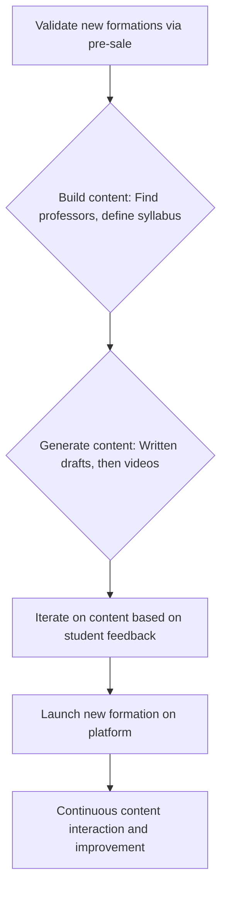

## Thesis
Ucademy runs content/education product as rapid business-driven iteration — ship value to the existing base before worshipping PM frameworks.

## Context
Ucademy is an online academy preparing students for competitive exams in Spain, such as university entrance exams and civil service positions. The company operates in a market where traditional, often less technologically advanced, preparation methods are common.

## Operating loop

## Ownership
- Discovery: Primarily driven by sales team feedback and market demand for specific exams.
- Prioritization: Business-driven, focusing on delivering value to existing users and optimizing sales processes.
- Shipping: Rapid iteration and deployment to production to validate ideas.
- Sales Input: Heavily integrated into product decisions, with sales feedback shaping new offerings.
- Design: Supported by an internal team, with a focus on business needs and user experience.

## Evidence
- *The context changes very quickly, and if you're not there to see it, you can't propose solutions.*
- *We try to make the product team as close as possible to the business.*

## Gaps
- The specific metrics and processes for the internal content generation team are not detailed.
- The long-term product strategy beyond immediate business needs and sales optimization is not elaborated upon.
- The role of AI in future product development beyond content generation and initial query responses remains exploratory.

## Listen

- YouTube: [Product Leaders #4 - El Producto en Negocios de Contenido con Miquel Palet, CPO y fundador de Ucademy](https://www.youtube.com/watch?v=vQmWZsV_Qto)
- Audio: [episode audio](https://anchor.fm/s/ddca5200/podcast/play/70339459/https%3A%2F%2Fd3ctxlq1ktw2nl.cloudfront.net%2Fstaging%2F2023-4-13%2F329388429-44100-2-e1db3b6470a6c.mp3)
- Show: [Entrevistas a Product Leaders](https://podcasters.spotify.com/pod/show/danidiestre)
- Host: [Dani Diestre](https://www.youtube.com/@DaniDiestre)

_Unofficial community note. Episode © host / guests. See [docs/LEGAL.md](../docs/LEGAL.md)._
