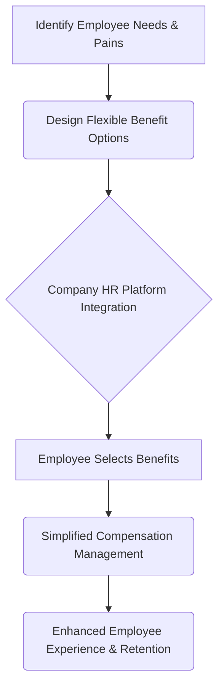

## Thesis
Cobee wins B2B2C by making employees want Cobee benefits — HR buys the platform, but product prioritizes employee-side value so retention pulls adoption.

## Context
Cobee is a B2B2C company that provides a platform for employee benefits and flexible compensation. They aim to disrupt the traditional, often cumbersome, employee benefits experience by offering a modern, employee-centric solution that benefits both the company and its workforce.

## Operating loop

## Ownership
- Discovery: Product team, HR users, employees
- Prioritization: Product team, informed by user feedback and business goals
- Shipping: Product team
- Sales Input: Sales team, HR stakeholders
- Design: Design team, integrated within product squads

## Evidence
- *The strategy of product is to identify the problems I need to solve, not to identify what features I'm going to release.*
- *The focus is precisely that: to be the option that you as an employee want your compensation to be with Cobee because you see the value.*

## Gaps
- The specific metrics used to measure the success of the platform beyond NPS are not detailed.
- The exact process for prioritizing features derived from large enterprise clients versus broader user needs is not fully elaborated.
- The long-term product vision beyond international expansion and verticalization remains somewhat abstract.

## Listen

- YouTube: [Product Leaders #5 - Producto en Negocios B2B2C con Virginia Diego, Head of Product de Cobee](https://www.youtube.com/watch?v=cEH9WEn-Z9o)
- Audio: [episode audio](https://anchor.fm/s/ddca5200/podcast/play/70891796/https%3A%2F%2Fd3ctxlq1ktw2nl.cloudfront.net%2Fstaging%2F2023-4-23%2F331119116-44100-2-0a1b386c55fcd.mp3)
- Show: [Entrevistas a Product Leaders](https://podcasters.spotify.com/pod/show/danidiestre)
- Host: [Dani Diestre](https://www.youtube.com/@DaniDiestre)

_Unofficial community note. Episode © host / guests. See [docs/LEGAL.md](../docs/LEGAL.md)._
