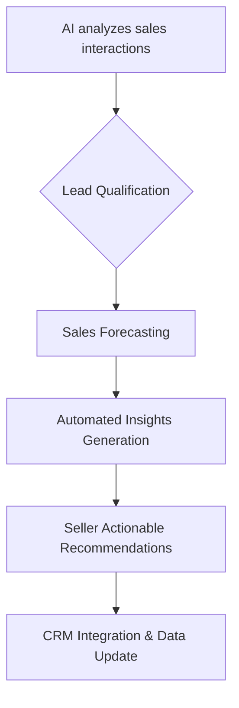

## Thesis
Piper automates sales lead qualification and forecasting with AI — product value is seller hours recovered, not another CRM dashboard.

## Context
Piper offers an AI-powered platform designed to assist sales teams by automating lead qualification, providing sales forecasts, and generating insights from customer interactions. The company is in its early stage, focusing on developing and refining its AI solutions for the B2B sales market.

## Operating loop

## Ownership
*   **Discovery**: Unknown
*   **Prioritization**: Unknown
*   **Shipping**: Unknown
*   **Sales Input**: Unknown
*   **Design**: Unknown

## Evidence
*   *The idea of a sales rep is to sell, and the AI's job is to maximize that.*
*   *The AI's job is to maximize that, to give them the information they need to sell more.*

## Gaps
*   The specific methodologies for AI model training and validation are not detailed.
*   The company's go-to-market strategy and customer acquisition process are not elaborated upon.
*   Details regarding the team structure and specific roles within Piper are absent.

## Listen

- YouTube: [Product Leaders #9 - El futuro de los datos con Michele Trevisiol, Co Founder en Piper y former SVP of Data en Jobandtalent](https://www.youtube.com/watch?v=t7Jsim7c1vY)
- Audio: [episode audio](https://anchor.fm/s/ddca5200/podcast/play/72399951/https%3A%2F%2Fd3ctxlq1ktw2nl.cloudfront.net%2Fstaging%2F2023-5-21%2F336127052-44100-2-1edffba4cde82.mp3)
- Show: [Entrevistas a Product Leaders](https://podcasters.spotify.com/pod/show/danidiestre)
- Host: [Dani Diestre](https://www.youtube.com/@DaniDiestre)

_Unofficial community note. Episode © host / guests. See [docs/LEGAL.md](../docs/LEGAL.md)._
