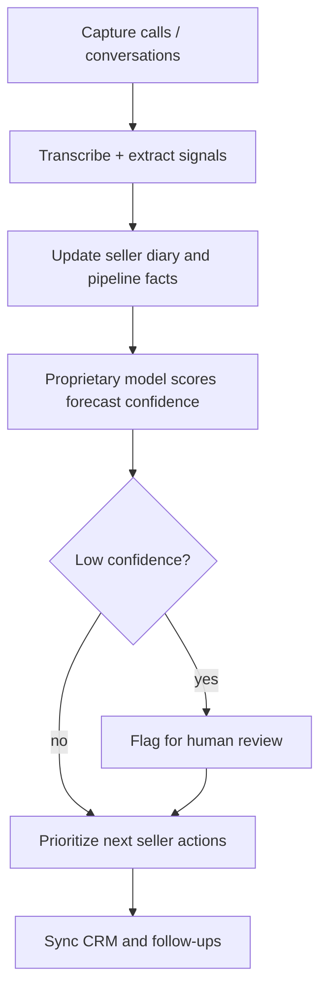

## Thesis
Piper is a data founder’s sales OS — proprietary models score pipeline forecasts and conversation confidence so sellers act on probability, not another CRM dashboard.

## Context
Piper is an early sales-intelligence startup co-founded by Michele Trevisiol (ex–SVP of Data at Jobandtalent; research path through Yahoo advertising / recommendation systems). The product listens to seller conversations, drafts a daily diary of what happened, and feeds forecasting and CRM updates from that history.

## Operating loop

## Ownership
- **Discovery:** Founder-led from a data/ML career (Jobandtalent data org, applied research) — the product bet is how sales data becomes a model, not a reporting layer.
- **Prioritization:** Forecast confidence and pipeline gaps decide what sellers see next.
- **Shipping:** Transcription → structured sales memory → model scores → CRM sync.
- **Sales input:** Sellers are the user; the co-founder frames the problem as maximizing time spent selling.
- **Design:** Diary-style interface that resumes meetings and surfaces what to ask next.

## Evidence
- Episode frames Piper as helping sellers “vender mucho más” by automating the information work around the sale.
- Forecast confidence and CRM sync are called out as product surfaces — the model should say when it does not trust the deal state.
- Guest path is explicitly data leadership (Jobandtalent SVP of Data) applied to a sales product, not a generic CRM rebuild.

## Gaps
- ASR for this episode is noisy (mixed Italian/Spanish); ownership detail beyond founder intent is thin.
- Exact model stack and training loop are not specified beyond proprietary models + transcripts.
- Team shape beyond the co-founder is unclear.

## Listen

- YouTube: [Product Leaders #9 - El futuro de los datos con Michele Trevisiol, Co Founder en Piper y former SVP of Data en Jobandtalent](https://www.youtube.com/watch?v=t7Jsim7c1vY)
- Audio: [episode audio](https://anchor.fm/s/ddca5200/podcast/play/72399951/https%3A%2F%2Fd3ctxlq1ktw2nl.cloudfront.net%2Fstaging%2F2023-5-21%2F336127052-44100-2-1edffba4cde82.mp3)
- Show: [Entrevistas a Product Leaders](https://podcasters.spotify.com/pod/show/danidiestre)
- Host: [Dani Diestre](https://www.youtube.com/@DaniDiestre)

_Unofficial community note. Episode © host / guests. See [docs/LEGAL.md](../docs/LEGAL.md)._
