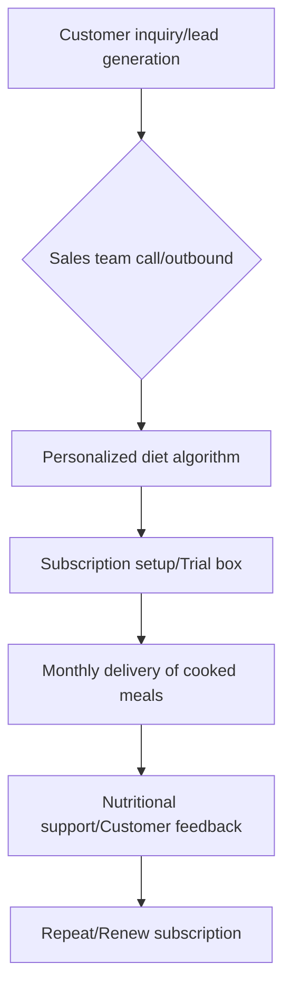

## Thesis
Dogfy Diet bets on cooked, personalized dog meals on subscription — product is humanization of pet food, not kibble SKUs in a pet aisle.

## Context
Dogfy Diet is a subscription-based company providing natural, cooked meals for dogs. The company operates in the growth stage, targeting pet owners who view their dogs as family members and are increasingly concerned about their pets' nutrition.

## Operating loop

## Ownership
*   **Discovery:** Primarily driven by customer interactions and feedback, with a focus on understanding pet needs and owner concerns. The sales team plays a key role in gathering qualitative data.
*   **Prioritization:** Influenced by customer feedback, market trends (humanization of pets), and business goals, with a strong emphasis on maintaining high retention rates.
*   **Shipping:** Managed through a premium logistics service that includes temperature-controlled packaging and a dedicated courier team to handle deliveries and re-scheduling.
*   **Sales Input:** Directly integrated into the product development and refinement process through the sales team's outbound calls and customer interactions.
*   **Design:** Involves both digital product design (website, wizard, checkout) and physical product design (packaging, meal presentation), with a focus on user experience and brand consistency.

## Evidence
*   *We have like a team of nutritionists that are available to the client within the monthly fee.*
*   *We are the other side of the coin, we make personalized cooked food, we send it home, we send it in daily portions, you forget about it, you take it out of the fridge, heat it up and serve it.*

## Gaps
*   The specific metrics used to measure the success of the in-house CRM and its impact on customer retention are not detailed.
*   The exact criteria for determining when to expand into new markets or introduce new product lines (e.g., for cats) are not fully elaborated.
*   While the company emphasizes its nutritional support, the precise attribution of improved retention to this service versus other value propositions remains unquantified.

## Listen

- YouTube: ["Queremos facturar 60M en 2024" con Gonzalo Noy, CEO y Co Founder de Dogfy Diet](https://www.youtube.com/watch?v=kn_LLX8AxQU)
- Audio: [episode audio](https://anchor.fm/s/ddca5200/podcast/play/82979845/https%3A%2F%2Fd3ctxlq1ktw2nl.cloudfront.net%2Fstaging%2F2024-1-21%2F368225154-44100-2-4bceccb6b5c48.mp3)
- Show: [Entrevistas a Product Leaders](https://podcasters.spotify.com/pod/show/danidiestre)
- Host: [Dani Diestre](https://www.youtube.com/@DaniDiestre)

_Unofficial community note. Episode © host / guests. See [docs/LEGAL.md](../docs/LEGAL.md)._
