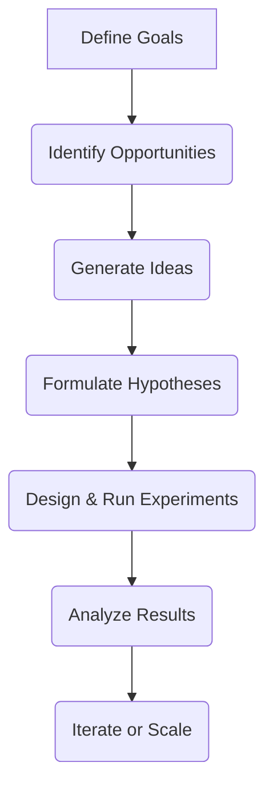

## Thesis
Growth is a continuous, data-driven process of experimentation focused on identifying and executing opportunities to accelerate business expansion.

## Context
Product Hackers is an agency that embeds growth teams into client companies to drive expansion. They operate across various business models, from e-commerce to SaaS, focusing on measurable growth outcomes.

## Operating loop

## Ownership
*   **Discovery:** Growth team, in collaboration with client stakeholders.
*   **Prioritization:** Growth team, using frameworks like GOIT (Goals, Opportunities, Ideas, Experiments).
*   **Shipping:** Primarily handled by the client's internal technology team, with Product Hackers providing code for implementation.
*   **Sales-Input:** Implicitly handled through understanding client business models and objectives.
*   **Design:** Growth Designer, challenging ideas and ensuring alignment with business goals.

## Evidence
*   *We launch around 200 experiments per month.*
*   *Growth is a model of experimentation that is a bit of a nexus between product, marketing, and data.*

## Gaps
*   Specific details on how Product Hackers integrates with client sales teams are not elaborated.
*   The exact structure of client-side teams that Product Hackers collaborates with is not fully detailed.
*   While AI is mentioned as a tool, its specific impact on the *strategic* direction of experiments is not deeply explored.

## Listen

- YouTube: ["Todo el mundo debería querer que la empresa crezca" con Juanma Varo, Head of Growth Product Hackers](https://www.youtube.com/watch?v=OE3BlZmK610)
- Audio: [episode audio](https://anchor.fm/s/ddca5200/podcast/play/79819823/https%3A%2F%2Fd3ctxlq1ktw2nl.cloudfront.net%2Fstaging%2F2023-11-10%2F359298117-44100-2-d16a3d2036e6b.mp3)
- Show: [Entrevistas a Product Leaders](https://podcasters.spotify.com/pod/show/danidiestre)
- Host: [Dani Diestre](https://www.youtube.com/@DaniDiestre)

_Unofficial community note. Episode © host / guests. See [docs/LEGAL.md](../docs/LEGAL.md)._
