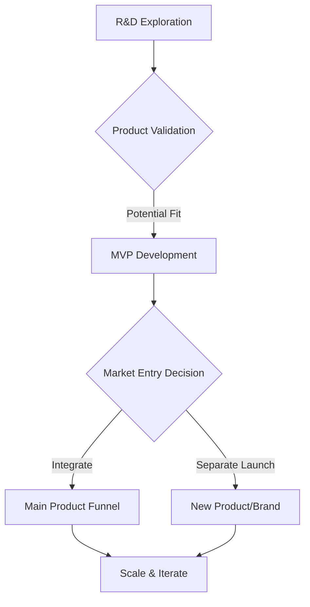

## Thesis
Typeform ships without worshipping frameworks — founder-led R&D explores bets, then either folds them into the main form product or spins them as separate brands.

## Context
Typeform, a global brand founded in Barcelona in 2012, offers an online form creation tool used by individuals and businesses across various sectors. The company has evolved from its early days to become a significant player in the SaaS market.

## Operating loop

## Ownership
- **Discovery**: R&D teams and founders explore new technologies and user needs.
- **Prioritization**: Decisions are made based on product fit, market potential, and strategic alignment.
- **Shipping**: Product makers and dedicated teams handle development and iteration.
- **Sales Input**: Incorporated through market analysis and customer feedback loops.
- **Design**: Heavily integrated from the start, with strong design teams influencing roadmap and product definition.

## Evidence
- *We had a R&D team that was led by David, the founder of Typeform... they explored many technologies.*
- *The main thing was to create a super strong brand and always put the user first through user experience.*

## Gaps
- The specific metrics used to evaluate the success of R&D explorations before committing to an MVP are not detailed.
- The exact process for deciding whether to integrate a new product into the main Typeform funnel versus launching it as a separate brand is not fully elaborated.
- Details on the day-to-day operational cadence and rituals for the R&D teams are not provided.

## Listen

- YouTube: [Trabajar PRODUCTO SIN Frameworks | Arnau Romero, Director de Producto de Typeform](https://www.youtube.com/watch?v=hfVtB1w0xjc)
- Audio: [episode audio](https://anchor.fm/s/ddca5200/podcast/play/87613648/https%3A%2F%2Fd3ctxlq1ktw2nl.cloudfront.net%2Fstaging%2F2024-5-4%2F379728914-44100-2-374c45a77cbe1.mp3)
- Show: [Entrevistas a Product Leaders](https://podcasters.spotify.com/pod/show/danidiestre)
- Host: [Dani Diestre](https://www.youtube.com/@DaniDiestre)

_Unofficial community note. Episode © host / guests. See [docs/LEGAL.md](../docs/LEGAL.md)._
